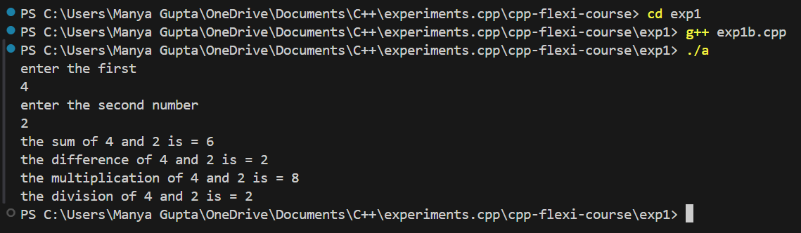

# Experiment 1 - C++ Flexi Course

## Overview
This experiment is part of the `cpp-flexi-course`, a comprehensive course designed to help learners master C++ programming. In this experiment, we focus on basic input-output statements, mathematical operators, e.g., "basic syntax and data types in C++".

## Objectives
- Understand and implement basic C++ syntax.
- Learn about C++ data types and their usage.
- Gain hands-on experience by solving practical problems.

## Prerequisites
Before you begin, make sure you have the following software installed:
- A C++ compiler (e.g., GCC, Clang)
- A text editor or IDE (e.g., Visual Studio Code, CLion)

## Files and Structure
The directory structure for `exp1` is as follows:

## Instructions
To compile and run the program:

1. Open a terminal and navigate to the `exp1` directory.
2. Compile the program using your C++ compiler. For example:
   ```bash
   g++ -o exp1 main.cpp

## Run the compiled program:
    ```bash
    ./exp1

## Example
    ```bash 
    g++ -o exp1 main.cpp
    ./exp1 < input.txt

## Output 
-Exp1a:


-Exp1b:


