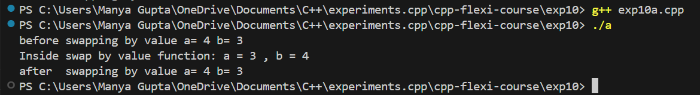
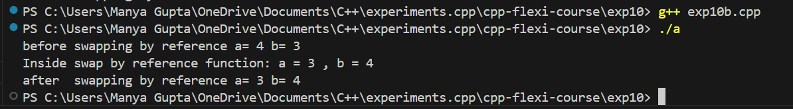

# C++ Flexi Course - Experiment 10

This directory contains the materials and code for Experiment 10 in the C++ Flexi Course. This experiment covers basic techniques for swapping variables using different methods in C++.

## Overview

In this experiment, you will:
- Learn to perform variable swapping using different techniques in C++.
- Understand the concepts of swapping by value and swapping by reference.

## Features

- **Swap by Value:** Swapping variables by passing their values to a function.
- **Swap by Reference:** Swapping variables by passing their addresses (references) to a function.

## Prerequisites

Before running the code, ensure you have the following:
- **C++ Compiler:** A C++ compiler such as `g++` or `clang++`.
- **Basic Knowledge of C++:** Familiarity with C++ syntax, functions, and basic input/output operations.

## Setup

To set up the project locally, follow these steps:

### 1. Clone the Repository

Clone the repository to your local machine:

```bash
exp10/
├── src/
│   ├── swap_by_value.cpp     # Source code for swapping by value
│   ├── swap_by_reference.cpp # Source code for swapping by reference
├── include/
│   ├── [header files]
├── README.md                  # This file
└── [any other relevant files]
```

## Compilation and Execution

To compile and run the experiments, follow these steps:

### Using Command Line

#### Compile and Run `swap_by_value.cpp`

1. **Compile the Program**

    ```bash
    g++ src/swap_by_value.cpp -o swap_by_value
    ```

2. **Run the Compiled Program**

    ```bash
    ./swap_by_value
    ```

#### Compile and Run `swap_by_reference.cpp`

1. **Compile the Program**

    ```bash
    g++ src/swap_by_reference.cpp -o swap_by_reference
    ```

2. **Run the Compiled Program**

    ```bash
    ./swap_by_reference
    ```

## Output

#### `swap_by_value.cpp`:

```plaintext
Before swapping by value a= 4 b= 3
Inside swap by value function: a = 3 , b = 4
After swapping by value a= 4 b= 3
```
#### `swap_by_reference.cpp`:
```plaintext
Before swapping by reference a= 4 b= 3
Inside swap by reference function: a = 3 , b = 4
After swapping by reference a= 3 b= 4
```
## Output Images
- Exp10a:



- Exp10b:

