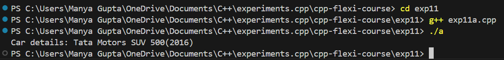
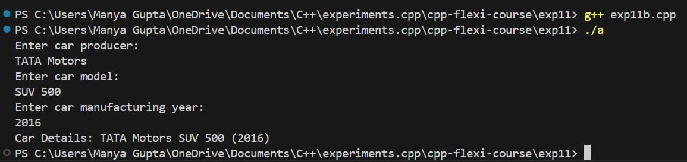
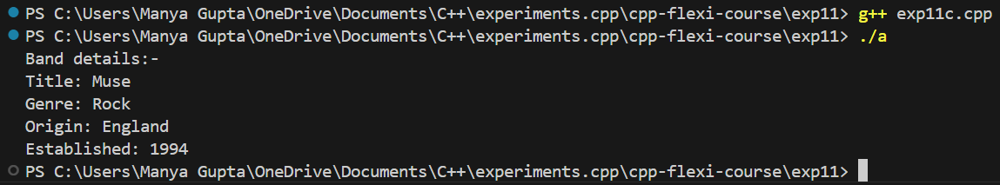
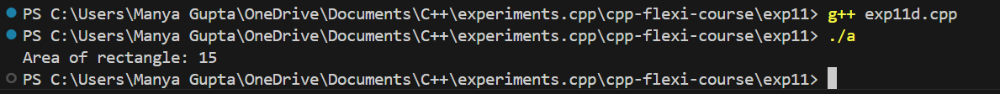

# C++ Flexi Course - Experiment 11

This directory contains the materials and code for Experiment 11 in the C++ Flexi Course. This experiment demonstrates various class functionalities in C++, including defining attributes, user input, and methods for displaying information and calculating values.

## Overview

In this experiment, you will:
- Define and use classes with public and private attributes.
- Implement methods for user input, information display, and calculations.

## Features

- **Basic Class Definition:** Create a class with attributes and access them in the main program.
- **User Input and Display:** Allow user input for class attributes and display them.
- **Information Display:** Show class information through methods.
- **Private Attributes:** Use private attributes with public methods for data manipulation and access.

## Prerequisites

Before running the code, ensure you have the following:
- **C++ Compiler:** A C++ compiler such as `g++` or `clang++`.
- **Basic Knowledge of C++:** Familiarity with C++ syntax, functions, and basic input/output operations.

## Setup

To set up the project locally, follow these steps:

### 1. Clone the Repository

Clone the repository to your local machine:

```bash
exp10/
├── src/
│   ├── swap_by_value.cpp     # Source code for swapping by value
│   ├── swap_by_reference.cpp # Source code for swapping by reference
├── include/
│   ├── [header files]
├── README.md                  # This file
└── [any other relevant files]
```
## Compilation and Execution

To compile and run the experiments, follow these steps:

### Using Command Line

#### Compile and Run `exp11a.cpp`

```bash
g++ src/exp11a.cpp -o exp11a
./exp11a
```
#### Compile and Run `exp11b.cpp`
```bash
g++ src/exp11b.cpp -o exp11b
./exp11b
```
#### Compile and Run `exp11c.cpp`
```bash
g++ src/exp11c.cpp -o exp11c
./exp11c
```
#### Compile and Run `exp11d.cpp`
```bash
g++ src/exp11d.cpp -o exp11d
./exp11d
```

## Output Images
- Exp11a:



- Exp11b:



- Exp11c:



- Exp11d:


