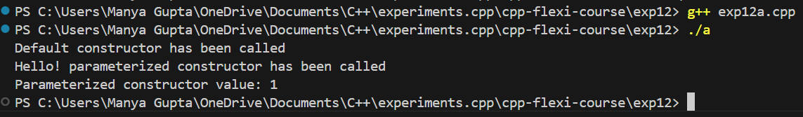
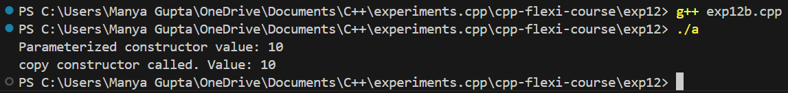
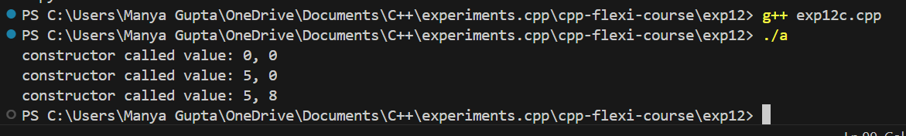
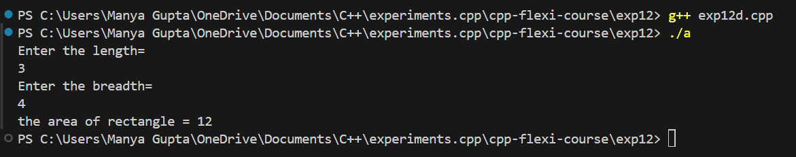
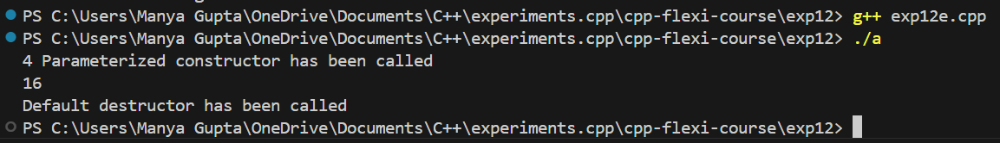

# Experiment 12 - Understanding Constructors and Destructors in C++

## Objective

The purpose of this experiment is to learn about different types of constructors and destructors in C++. You will explore:

- Default Constructors
- Parameterized Constructors
- Copy Constructors
- Destructors

## Code Overview

### 1. Default Constructor

A default constructor initializes an object when no arguments are provided. This constructor is automatically invoked when an object is created without any parameters.

```cpp
// Default Constructor Example
class CLASS1 {
public:
    CLASS1() {
        cout << "Default constructor has been called" << endl;
    }
};
```
### 2. Parameterized Constructor

A parameterized constructor allows you to pass values to initialize data members when an object is created.

```cpp
// Parameterized Constructor Example
class CLASS1 {
public:
    CLASS1(string value, int a) {
        cout << value << " parameterized constructor has been called" << endl;
        cout << "Parameterized constructor value: " << a;
    }
};
```
### 3. Copy Constructor

The copy constructor creates a new object by copying the data members of an existing object. It is called when an object is initialized with another object of the same class.
```cpp
// Copy Constructor Example
class CLASS1 {
private:
    int value;
public:
    CLASS1(const CLASS1 &obj) {
        value = obj.value;
        cout << "Copy constructor called. Value: " << value << endl;
    }
};
```

### 4. Constructor with Default Values

You can define parameterized constructors with default values for flexibility in object creation.

```cpp
// Constructor with Default Values Example
class Class1 {
public:
    Class1(int val1 = 0, int val2 = 0) {
        cout << "Constructor called with values: " << val1 << ", " << val2 << endl;
    }
};
```
### 5. Destructor

A destructor is automatically called when an object is destroyed, allowing you to release resources.

```cpp
// Destructor Example
class CLASS1 {
public:
    ~CLASS1() {
        cout << "Default destructor has been called" << endl;
    }
};
```

## Usage

To run the code, simply compile it using a C++ compiler (e.g., g++ or clang).

```bash
g++ exp12.cpp -o exp12
./exp12

## Output Images
- Exp12a:



- Exp12b:



- Exp12c:



- Exp12d:



- Exp12e:

