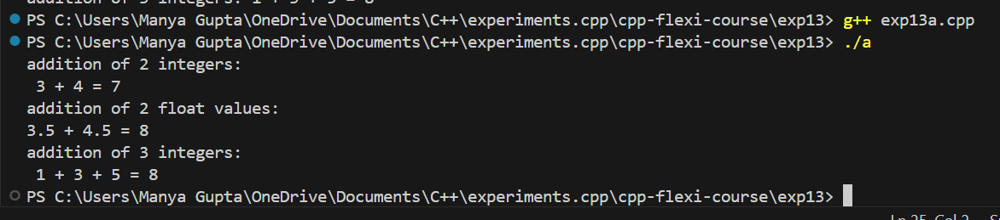
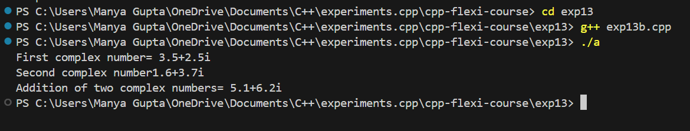

# Experiment 13 - Understanding Function and Operator Overloading in C++

## Objective

The purpose of this experiment is to understand the concepts of function overloading and operator overloading in C++. You will explore:

- Function Overloading
- Operator Overloading

## Code Overview

### 1. Function Overloading

Function overloading allows you to define multiple functions with the same name but different parameter types or numbers. The correct function is selected based on the arguments passed.

```cpp
// Function Overloading Example
int add(int a, int b) {
    return a + b;
}

float add(float a, float b) {
    return a + b;
}

int add(int a, int b, int c) {
    return a + b + c;
}

int main() {
    cout << "Addition of 2 integers: 3 + 4 = " << add(3, 4) << endl;
    cout << "Addition of 2 float values: 3.5 + 4.5 = " << add(3.5f, 4.5f) << endl;
    cout << "Addition of 3 integers: 1 + 3 + 5 = " << add(1, 3, 5) << endl;
    return 0;
}
```

## 2. Operator Overloading

Operator overloading allows you to define how operators work with user-defined types such as classes. In this example, we overload the `+` operator for a `Complex` class.

```cpp
// Operator Overloading Example for Complex Numbers
class Complex {
private:
    float real;
    float imag;
    
public:
    // Constructor
    Complex(float r = 0, float i = 0) : real(r), imag(i) {}

    // Overload the + operator
    Complex operator+(const Complex &obj) {
        Complex temp;
        temp.real = real + obj.real;
        temp.imag = imag + obj.imag;
        return temp;
    }

    // Display function
    void display() const {
        cout << real << " + " << imag << "i" << endl;
    }
};

int main() {
    Complex c1(3.5, 2.5);
    Complex c2(1.6, 3.7);
    Complex c3 = c1 + c2;

    cout << "First complex number: ";
    c1.display();
    
    cout << "Second complex number: ";
    c2.display();
    
    cout << "Addition of two complex numbers: ";
    c3.display();

    return 0;
}
```

### Usage

To run the code, simply compile it using a C++ compiler (e.g., `g++` or `clang`).

```bash
g++ exp13.cpp -o exp13
./exp13
```

### Output Images

- **Exp13a**:



- **Exp13b**:



