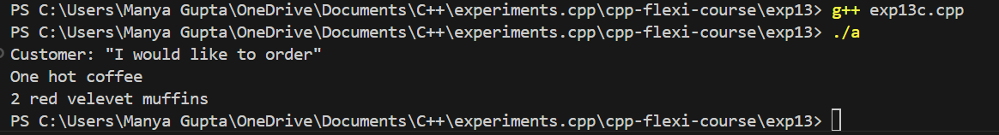
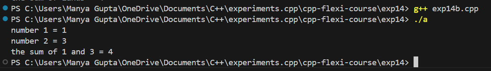
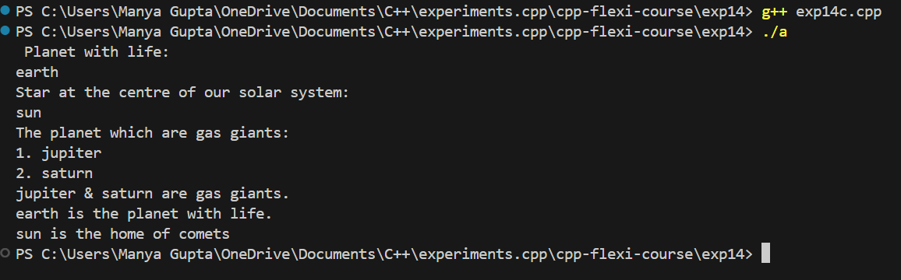
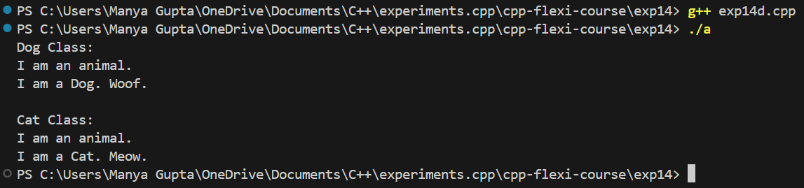

# Experiment 14 - Understanding Inheritance in C++

## Objective

The purpose of this experiment is to understand various types of inheritance in C++. You will explore:

- Single Inheritance
- Multiple Inheritance
- Multilevel Inheritance
- Hierarchical Inheritance

## Code Overview

### 1. Single Inheritance (Exp14a)

In single inheritance, a class (derived class) inherits from a single base class.

```cpp
#include <iostream>
#include <string>
using namespace std;
//----------------SINGLE INHERITANCE----------------
//-----Parent Class------
class Bakery
{
    //-----access mode-----
protected:
    string coffee;
    //-----access mode-----
public:
    void muffins()
    {
        cout << "2 red velevet muffins" << endl;
    }
    char beverages(string coff)
    {
        coffee = coff;
        cout << "One " << coffee << " coffee" << endl;
    }
};
//---------INHERITANCE---------
//-------Derrived Class--------
class Menu : public Bakery
{
    //-----access mode-----
public:
    void order()
    {
        cout << "Customer: \"I would like to order\"" << endl;
    }
};
int main()
{
    //-----object of the derrived class-----
    Menu m;
    m.order();
    m.beverages("hot");
    m.muffins();
    return 0;
}
```

### 2. Multiple Inheritance (Exp14b)
In multiple inheritance, a class can inherit from more than one base class.

```cpp
#include <iostream>
using namespace std;
//--------------MULTIPLE INHERITANCE---------------
class Base1
{
protected:
    int a;

public:
    int num1(int number1 = 0)
    {
        a = number1;
    }
};
class Base2
{
protected:
    int b;

public:
    int num2(int number2 = 0)
    {
        b = number2;
    }
};
class Child : public Base1, public Base2
{
public:
    int sum()
    {
        int ans = a + b;
        cout << "number 1 = " << a << endl;
        cout << "number 2 = " << b << endl;
        cout << "the sum of " << a << " and " << b << " = " << ans;
    }
};
int main()
{
    Child c;
    c.num1(1);
    c.num2(3);
    c.sum();
    return 0;
}
```

### 3. Multilevel Inheritance (Exp14c)
In multilevel inheritance, a class is derived from a class that is already derived from another class.

```cpp
#include <iostream>
using namespace std;
//----------------------------MULTILEVEL INHERITANCE--------------------------
//------Base class------
class planets
{
public:
    string saturn, jupiter;

    void gas()
    {
        cout << "The planet which are gas giants: " << endl;
        cout << "1. ";
        cin >> saturn;
        cout << "2. ";
        cin >> jupiter;
    }
};
//------Derrived Class------
class Life1 : public planets
{
public:
    string earth;
    void life()
    {

        cout << " Planet with life: " << endl;
        cin >> earth;
    }
};
//------Derrived class-------
class Heat : public Life1
{
public:
    string star;
    void sun()
    {
        cout << "Star at the centre of our solar system: " << endl;
        cin >> star;
    }

    void display()
    {
        cout << saturn << " & " << jupiter << " are gas giants." << endl;

        cout << earth << " is the planet with life." << endl;
        cout << star << " is the home of comets" << endl;
    }
};
int main()
{
    Heat d;//object declaration
    d.life();
    d.sun();
    d.gas();
    d.display();
}
```

### 4. Hierarchical Inheritance (Exp14d)
In hierarchical inheritance, multiple classes are derived from a single base class.

```cpp
#include <iostream>
using namespace std;
//-------------------------HEIRARCHIAL INHERITANCE-------------------------
// base class
class Animal {
public:
    void info() {
        cout << "I am an animal." << endl;
    }
};

// derived class 1
class Dog : public Animal {
public:
    void bark() {
        cout << "I am a Dog. Woof." << endl;
    }
};

// derived class 2
class Cat : public Animal {
public:
    void meow() {
        cout << "I am a Cat. Meow." << endl;
    }
};

int main() {
    // object of Dog class
    Dog d1;
    cout << "Dog Class:" << endl;
    d1.info();  // parent Class function
    d1.bark();

    // object of Cat class
    Cat c1;
    cout << "\nCat Class:" << endl;
    c1.info();  // parent Class function
    c1.meow();

    return 0;
}
```

### Usage
To run the code, simply compile it using a C++ compiler (e.g., `g++` or `clang`).

```bash
g++ exp14.cpp -o exp14
./exp14
```

### Output Images

- **Exp14a** (Single Inheritance):



- **Exp14b** (Multiple Inheritance):



- **Exp14c** (Multilevel Inheritance):



- **Exp14d** (Hierarchical Inheritance):

