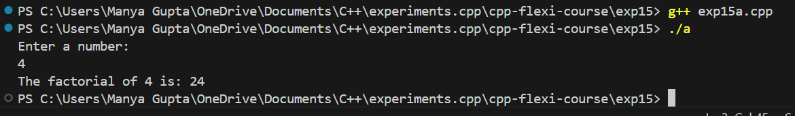
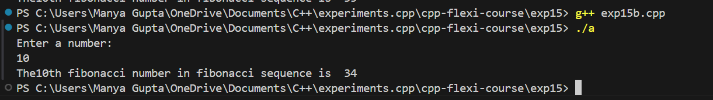
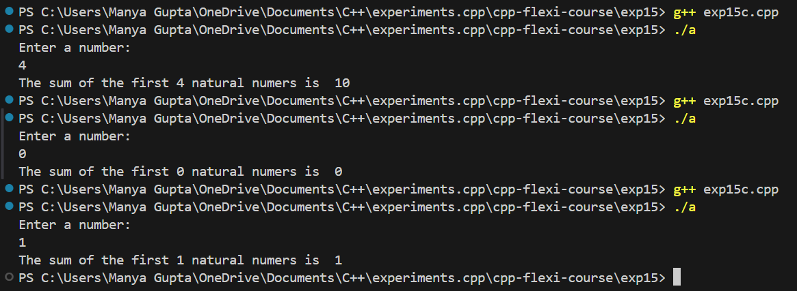

# Experiment 15 - Recursion in C++ Programs

This experiment demonstrates the use of recursion in C++ to solve problems like finding the factorial of a number, generating Fibonacci numbers, and calculating the sum of natural numbers.

## Exp15a: Factorial of a Number

### Description
This part of the experiment calculates the factorial of a given number using recursion.

### Code
```cpp
#include <iostream>
using namespace std;

//------function to find the factorial------
int factorial(int n)
{
    if (n == 0)
    {
        return 1;
    }
    else
    {
        return n * factorial(n - 1);
    }
}

int main()
{
    int num;
    cout << "Enter a number: " << endl;
    cin >> num;

    cout << "The factorial of " << num << " is: " << factorial(num) << endl;
    return 0;
}
```

## Exp15b: Fibonacci Series

### Description
This part of the experiment generates the nth Fibonacci number using recursion.

### Code
```cpp
#include <iostream>
using namespace std;

//------function to find the fibonacci series------
int fibo(int n)
{
    if (n == 0)
    {
        return 0;
    }
    else if (n == 1)
    {
        return 1;
    }
    else
    {
        return fibo(n - 1) + fibo(n - 2);
    }
}

int main()
{
    int num;
    cout << "Enter a number: " << endl;
    cin >> num;

    cout << "The " << num << "th fibonacci number in the sequence is  " << fibo(num - 1) << endl;
    return 0;
}
```

## Exp15c: Sum of Natural Numbers

### Description
This part of the experiment calculates the sum of the first `n` natural numbers using recursion.

### Code
```cpp
#include <iostream>
using namespace std;

//------function to find the sum of n natural numbers------
int sum_nat(int n)
{
    if (n == 0)
    {
        return 0;
    }
    else if (n == 1)
    {
        return 1;
    }
    else
    {
        return n + sum_nat(n - 1);
    }
}

int main()
{
    int num;
    cout << "Enter a number: " << endl;
    cin >> num;

    cout << "The sum of the first " << num << " natural numbers is  " << sum_nat(num) << endl;
    return 0;
}
```

## Conclusion
This experiment showcases the power of recursion in solving common problems such as finding factorials, Fibonacci sequences, and the sum of natural numbers. By breaking down larger problems into smaller subproblems, recursion allows for elegant and efficient solutions in C++.

### Output Images

- **Exp15a**



- **Exp15b**



- **Exp15c**

