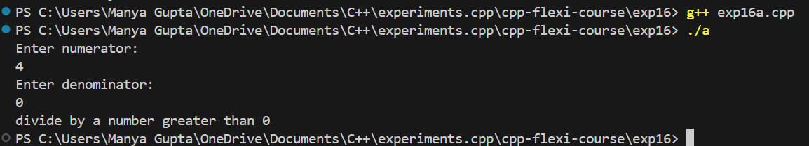
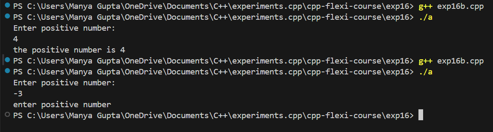
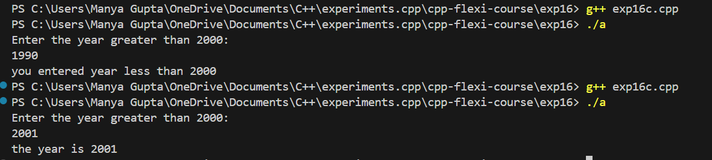

# AIM
To learn about exception handling in c++.

# Problem Statement

1.) Write a c++ program to get a customized error for entering a negative number.

2.) Write a c++ program to get a customized error for entering a year less than 2000.

# Theory

In C++, exceptions are runtime anomalies or abnormal conditions that a program encounters during its execution. The process of handling these exceptions is called exception handling. Using the exception handling mechanism, the control from one part of the program where the exception occurred can be transferred to another part of the code.

So basically using exception handling in C++, we can handle the exceptions so that our program keeps running.

### Output Images

- **Exp16a**

- **Exp16b**

- **Exp16c**

# Conclusion

We learnt to use exception handling in c++.