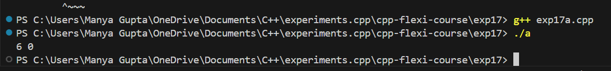
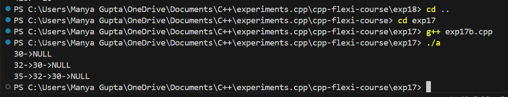

# AIM
To use linked list in c++.

# Problem Statement 
1.) To create a node in c++.

2.) To add node in c++.

# Theory 
A Linked List is a dynamic data structure, i.e., memory is allocated at run time, and memory size can be changed at run time according to our requirements. 
A linked list is a linear data structure that allows the users to store data in non-contiguous memory locations. 
A linked list is defined as a collection of nodes where each node consists of two members which represents its value and a next pointer which stores the address for the next node.

### Output Images

- **Exp17a**

- **Exp17b**

