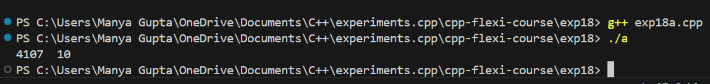

# AIM
To study and implement stack implementation using array.

# Problem Statement
1.) Write a c++ program to do stack implementation.

# Theory

Stacks are a type of container adaptors with LIFO(Last In First Out) type of working, where a new element is added at one end (top) and an element is removed from that end only.  
Stack uses an encapsulated object of either vector or deque (by default) or list (sequential container class) as its underlying container, providing a specific set of member functions to access its elements. 

# Stack Syntax

To create a stack in C++, include the `<stack>` header file. Use the following syntax to define a `std::stack`:

```cpp
template <class Type, class Container = deque<Type> > class stack;
```

- **Type**: Represents the type of elements contained in the stack. It can be any valid C++ type, including user-defined types.
- **Container**: Represents the type of the underlying container object.

## Member Types

- **`value_type`**: Refers to the first template parameter, `Type`. It denotes the element types.
- **`container_type`**: Refers to the second template parameter, `Container`. It denotes the underlying container type.
- **`size_type`**: Unsigned integral type that denotes the size of the stack.

## Functions Associated with `std::stack`

- **`empty()`**
  - Returns whether the stack is empty.
  - **Time Complexity:** O(1)

- **`size()`**
  - Returns the size of the stack.
  - **Time Complexity:** O(1)

- **`top()`**
  - Returns a reference to the top-most element of the stack.
  - **Time Complexity:** O(1)

- **`push(g)`**
  - Adds the element `g` at the top of the stack.
  - **Time Complexity:** O(1)

- **`pop()`**
  - Deletes the most recently entered element of the stack.
  - **Time Complexity:** O(1)

### Output Images

- **Exp18a**


