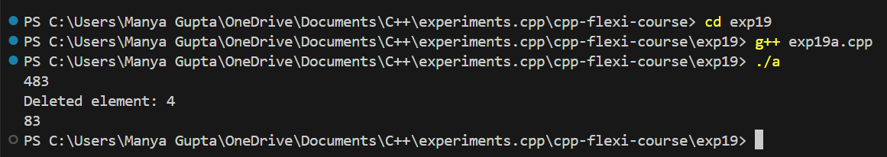

# AIM
To learn queue in c++.

# Poblem Statement
Write a program to dequeue & enqueue in c++.

# Theory

Queues are a type of container adaptors that operate in a first in first out (FIFO) type of arrangement. Elements are inserted at the back (end) and are deleted from the front. Queues use an encapsulated object of deque or list (sequential container class) as its underlying container, providing a specific set of member functions to access its elements.

## Methods of Queue

The time complexity and definitions of the following functions are as follows:

| Method              | Time Complexity | Definition |
|---------------------|-----------------|------------|
| **`queue::empty()`** | O(1)            | Returns whether the queue is empty. It returns `true` if the queue is empty; otherwise, returns `false`. |
| **`queue::size()`**  | O(1)            | Returns the size of the queue. |
| **`queue::swap()`**  | O(1)            | Exchanges the contents of two queues. The queues must be of the same data type, though sizes may differ. |
| **`queue::emplace()`** | O(1)          | Inserts a new element into the queue container. The new element is added to the end of the queue. |
| **`queue::front()`** | O(1)            | Returns a reference to the first element of the queue. |
| **`queue::back()`**  | O(1)            | Returns a reference to the last element of the queue. |
| **`queue::push(g)`** | O(1)            | Adds the element `g` at the end of the queue. |
| **`queue::pop()`**   | O(1)            | Deletes the first element of the queue. |

### Output Images

- **Exp19a**

