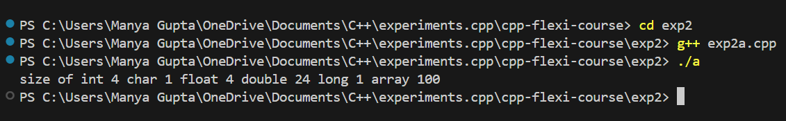
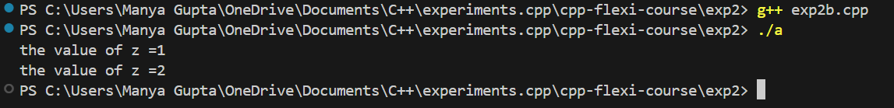

# exp2 - C++ Flexi Course

## Overview
 This project, `exp2`, is part of the C++ Flexi Course designed to enhance your understanding of C++ programming concepts through practical exercises. The experiments in this project focus on topics such as `static` and `sizeof` key words used in `exp2`.

## Features
 - Implementation of core C++ concepts.
 - Hands-on coding exercises to solidify understanding.
 - Examples and challenges to test your skills.

## Prerequisites
Ensure that you have the following installed before running the experiments:
 - C++ compiler (e.g., g++, clang++)
 - CMake (optional, if the project uses CMake)
 - A code editor or IDE (e.g., Visual Studio Code, CLion)

## Setup
Clone the repository to your local machine using:
    ```bash
    git clone https://github.com/manyagupta0209/cpp-flexi-course.git
    ```

## Navigate to the exp2 directory:
    ```bash
    cd cpp-flexi-course/exp2
    ```

## Compilation and Execution
 To run the experiments:

### Using Command Line

-Run the compiled program:
    ```bash
    g++ exp2(name_of_exp).cpp
    ./a
    ```

## Project Structure
 A brief overview of the project structure:

 makefile
 exp2/
 - src/               # Source files for the experiment
 - include/           # Header files
 - build/             # Directory for build files (if using CMake)
 - exp2_main.cpp      # Main entry point for the experiment
 - README.md          # This file

## Output

- Exp2a


- Exp2b
