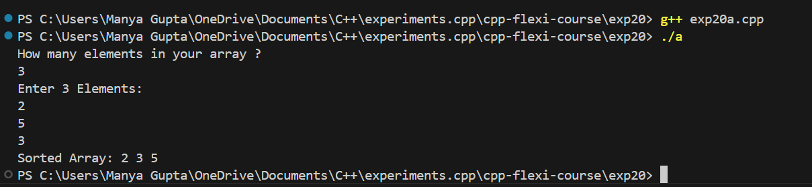
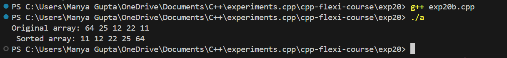
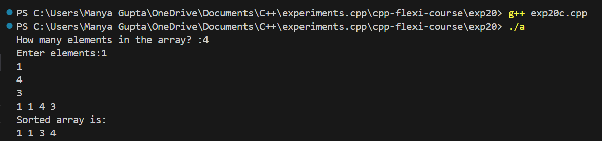

# AIM
To do sorting in c++.

 # Problem Statement
 1.) Write a c++ to do selection sorting.
 
 2.) Write a c++ to do insertion sorting.
 
 3.) Write a c++ to do bubble sorting.

 # Theory
 A Sorting Algorithm is used to rearrange a given array or list of elements according to a comparison operator on the elements. The comparison operator is used to decide the new order of elements in the respective data structure.

 Selection Sort is a comparison-based sorting algorithm. It sorts an array by repeatedly selecting the smallest (or largest) element from the unsorted portion and swapping it with the first unsorted element. This process continues until the entire array is sorted.

 Insertion sort is a simple sorting algorithm that works by iteratively inserting each element of an unsorted list into its correct position in a sorted portion of the list. It is like sorting playing cards in your hands. You split the cards into two groups: the sorted cards and the unsorted cards. Then, you pick a card from the unsorted group and put it in the right place in the sorted group.

 Bubble Sort is the simplest sorting algorithm that works by repeatedly swapping the adjacent elements if they are in the wrong order. This algorithm is not suitable for large data sets as its average and worst-case time complexity are quite high.

# Problem Codes
```javascript
//PRAKHAR GUPTA
//23070123101

//SELECTION SORT
#include <iostream>
using namespace std;

void swap(int *a, int *b){
    int temp;
    temp = *a;
    *a=*b;
    *b=temp;

}
void s_sort(int *a, int elements){
    int n=0;
    int *b;

    while (n!= elements){
        b = a+1; 
        for(int i = 0; i<(elements-1)-n; i++){
            if(*a > *b) {
                swap(a,b);
            }
            b++;
        }
        n++;
        a++;
    }
}
int main(){
    int no_el;
    cout << "How many elements in your array ? "<<endl;
    cin>>no_el;
    int arr[no_el];
    cout<<"Enter "<<no_el<<" Elements: "<<endl;
    for(int i=0; i<no_el;i++){
        cin>>arr[i];
    }
    cout<<"Sorted Array: ";
    s_sort(&arr[0],no_el);

    for(int i=0; i<no_el;i++){
        cout<<arr[i]<< " ";

    }
    return 0;


}

//INSERTION SORT
#include <iostream>
using namespace std;

void insertionsort(int arr[], int n){
    for (int i = 1; i<n ; i++){
        int key = arr [i];
        int j =i-1;

        while (j>= 0 &&  arr[j]>key){
            arr[j+1] = arr[j];
            j--;
        }
        arr[j+1]= key;
    }
}
int main(){
    int arr[]= {64, 25, 12,22,11};
    int n = sizeof(arr) / sizeof(arr[0]);
    cout<< "Original array: ";
    for (int i =0; i<n;i++){
        cout<<arr[i]<<" ";
    }
    insertionsort(arr,n);
    cout<< "\n Sorted array: ";
    for (int i = 0; i< n ; i++){
        cout << arr[i]<<" ";
    }
    return 0;
    }

//BUBBLE SORT
#include<iostream>
using namespace std;

void swap(int* a,int* b){
int temp;
 temp=*a;
*a=*b;
 *b=temp;
}
int main(){
 int elements;
  cout<<"How many elements in the array? :";
  cin>>elements;
   int array[elements];
 cout<<"Enter elements:";
for(int i=0;i<elements;i++){
 cin>>array[i];
 }
for(int i=0;i<elements;i++){
 cout<<array[i]<<" ";
  }
 int n=0;
while(n!=elements){
 for(int i=0;i<elements-n;i++){
if(array[i]>array[i+1]){
swap(&array[i],&array[i+1]);
 }
}
 n++;
 }
 cout<<"\nSorted array is:"<<endl;
for(int i=0;i<elements;i++){
 cout<<array[i]<<" ";
 }

 return 0;
}
```


 # Output
 1.) SELECTION SORT
 

 

 2.) INSTERTION SORT


 3.) BUBBLE SORT


 # Conclusion
We learnt to do selection sort, insertion sort and bubble sort in c++.

### Output Images

- **Exp20a**



- **Exp20b**



- **Exp20c**

