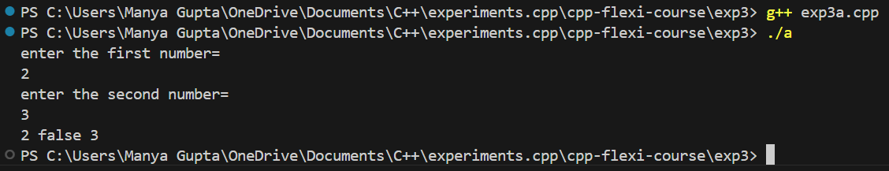
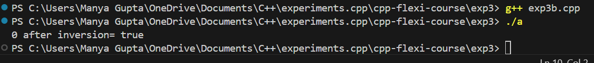
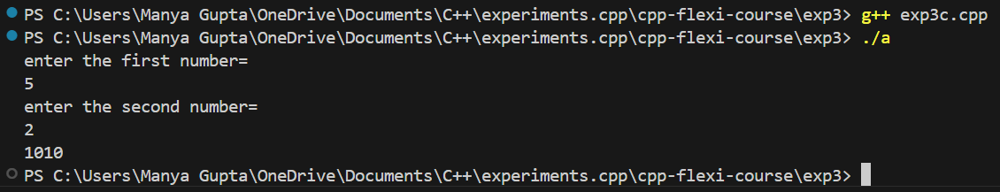

# Exp3 - C++ Flexi Course

## Overview
 This project is part of the "C++ Flexi Course" series, specifically focused on `exp3`. The purpose of this experiment is to understand the usage of `boolalpha` and `bitset` keywords.

## Features
 - Implementation of basic class structure
 - Demonstration of inheritance and polymorphism
 - Practical examples for operator overloading

## Prerequisites
 Before running the code in this experiment, ensure that you have the following installed:
 - A C++ compiler (e.g., GCC, Clang, or MSVC)
 - A development environment (e.g., Visual Studio Code, CLion, or any C++ IDE)

## Installation
Clone the repository and navigate to the `exp3` directory:
    ```bash
    git clone https://github.com/manyagupta0209/cpp-flexi-course.git
    cd cpp-flexi-course/exp3
    ```

## Project Structure
 The project is organized as follows:
 exp3/
├── src/                   # Source files
│   ├── main.cpp           # Main entry point of the project
│   └── [other files]      # Other C++ source files
├── include/               # Header files
├── CMakeLists.txt         # CMake configuration file (if used)
└── README.md              # This file


## Output
 - Exp3a
 

 - Exp3b
 

 - Exp3c
 
