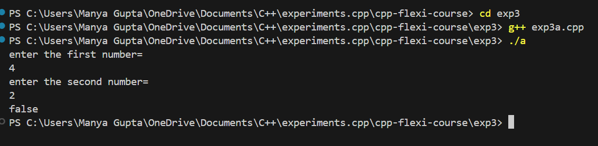
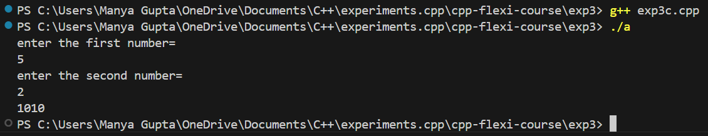

# Exp3 - C++ Flexi Course

## Overview
 This project is part of the "C++ Flexi Course" series, specifically focused on `exp3`. The purpose of this experiment is to understand the usage of `boolalpha` and `bitset` keywords.

## Features
 - Implementation of [specific feature 1, e.g., "basic class structure"]
 - Demonstration of [specific feature 2, e.g., "inheritance and polymorphism"]
 - Practical examples for [specific feature 3, e.g., "operator overloading"]

## Prerequisites
 Before running the code in this experiment, ensure that you have the following installed:
 - A C++ compiler (e.g., GCC, Clang, or MSVC)
 - A development environment (e.g., Visual Studio Code, CLion, or any C++ IDE)

## Installation
Clone the repository and navigate to the `exp3` directory:
    ```bash
    git clone https://github.com/manyagupta0209/cpp-flexi-course.git
    cd cpp-flexi-course/exp3
    ```

## Output
 - Exp3a
 

 - Exp3b
 

 - Exp3c
 
