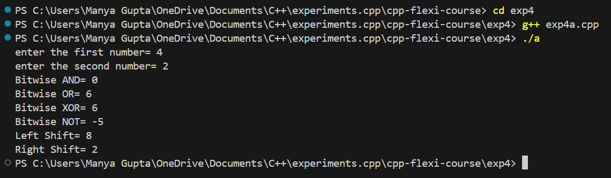
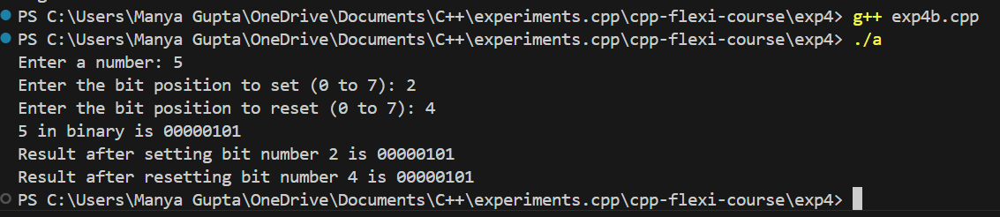
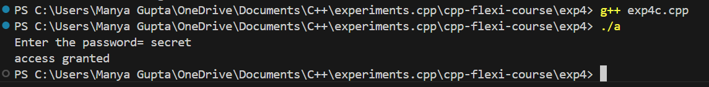

# C++ Bitwise Operations and Password Authentication Experiments


1. [Overview](#Overview)
2. [Features](#Features)
3. [Setup](#Setup)
4. [Output](#Output)

## Overview

This repository contains a collection of simple C++ programs that demonstrate fundamental concepts in bitwise operations and password authentication. These programs are designed to help beginners understand how to manipulate individual bits in integers and implement basic security checks using conditional statements.

## Features

- **Bitwise Operations**: Perform and explore various bitwise operations, including AND, OR, XOR, NOT, Left Shift, and Right Shift.
- **Bit Manipulation**: Set and reset specific bits in a number, and visualize the changes in the binary representation.
- **Password Authentication**: Implement a simple password check mechanism to grant or deny access based on user input.

## Setup

To run these programs on your local machine, follow the steps below:

1. **Clone the Repository**:
    ```sh
    git clone https://github.com/your-username/repo-name.git
    ```

2. **Navigate to the Project Directory**:
    ```sh
    cd repo-name
    ```

3. **Compile the Programs**:
    - For Experiment 4a:
      ```sh
      g++ -o exp4a exp4a.cpp
      ```
    - For Experiment 4b:
      ```sh
      g++ -o exp4b exp4b.cpp
      ```
    - For Experiment 4c:
      ```sh
      g++ -o exp4c exp4c.cpp
      ```

4. **Run the Executables**:
    ```sh
    ./bitwise_operations
    ./set_reset_bits
    ./password_authentication
    ```

By following these steps, you can easily compile and execute the C++ programs in this repository, allowing you to explore and learn from the experiments.

## Output
- Exp4a:



- Exp4b:



- Exp4c:

