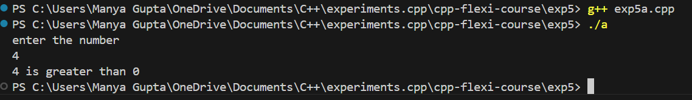
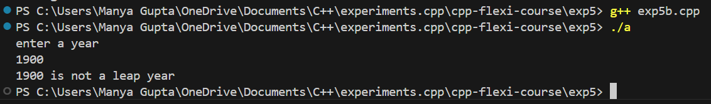
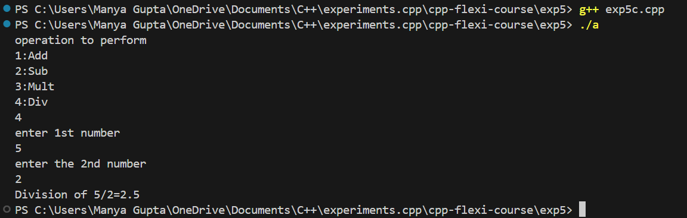
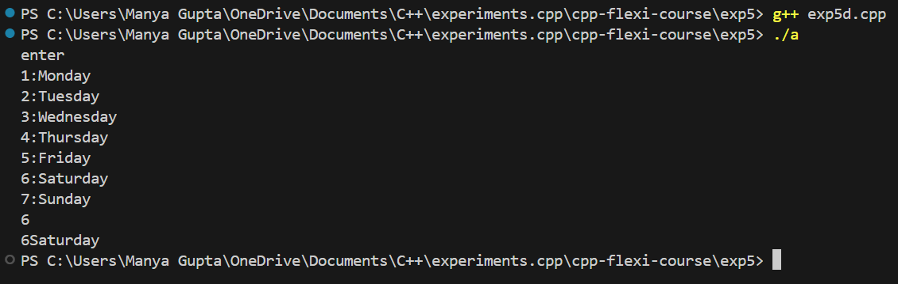
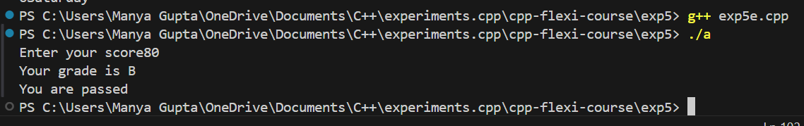

# C++ Conditional Statements and Basic Operations Experiments
1. [Overview](#Overview)
2. [Features](#Features)
3. [Setup](#Setup)
4. [Output](#Output)

## Overview

This repository contains a collection of C++ programs designed to demonstrate the use of conditional statements and basic arithmetic operations. These experiments are aimed at helping beginners understand how to implement logic using `if-else` conditions, `switch` statements, and how to perform simple operations like addition, subtraction, multiplication, and division.

## Features

- **Comparison Operations**: Determine if a number is greater than, less than, or equal to zero.
- **Leap Year Checker**: Verify whether a given year is a leap year.
- **Basic Calculator**: Perform addition, subtraction, multiplication, and division based on user input.
- **Days of the Week**: Output the corresponding day of the week based on a numerical input.
- **Grade Calculator**: Determine the grade and pass/fail status based on a given score.

## Setup

To run these programs on your local machine, follow these steps:

1. **Clone the Repository**:
    ```sh
    git clone https://github.com/your-username/cpp-experiments.git
    ```

2. **Navigate to the Project Directory**:
    ```sh
    cd repo-name
    ```

3. **Compile the Programs**:
    - For Experiment 1 (Comparison Operations):
      ```sh
      g++ -o exp5a exp5a.cpp
      ```
    - For Experiment 2 (Leap Year Checker):
      ```sh
      g++ -o exp5b exp5b.cpp
      ```
    - For Experiment 3 (Basic Calculator):
      ```sh
      g++ -o exp5c exp5c.cpp
      ```
    - For Experiment 4 (Days of the Week):
      ```sh
      g++ -o exp5d exp5d.cpp
      ```
    - For Experiment 5 (Grade Calculator):
      ```sh
      g++ -o exp5e exp5e.cpp
      ```

4. **Run the Executables**:
    ```sh
    ./exp5a
    ./exp5b
    ./exp5c
    ./exp5d
    ./exp5e
    ```

## Experiment Descriptions

### 1. Comparison Operations
This program takes an integer input from the user and determines whether the number is greater than, less than, or equal to zero.

### 2. Leap Year Checker
This program checks the validity of a given year and determines if it is a leap year based on the rules for leap years.

### 3. Basic Calculator
A simple calculator that performs addition, subtraction, multiplication, or division based on user input. It also checks for division by zero.

### 4. Days of the Week
This program takes an integer (1-7) as input and outputs the corresponding day of the week. If the input is outside this range, it indicates an invalid input.

### 5. Grade Calculator
This program evaluates a score input by the user and assigns a grade (A-F) based on the score, along with indicating whether the user has passed or failed.

By following the setup instructions, you can easily compile and execute these C++ programs on your local machine.

## Output
- Exp5a:



- Exp5b:



- Exp5c:



- Exp5d:



- Exp5e:

