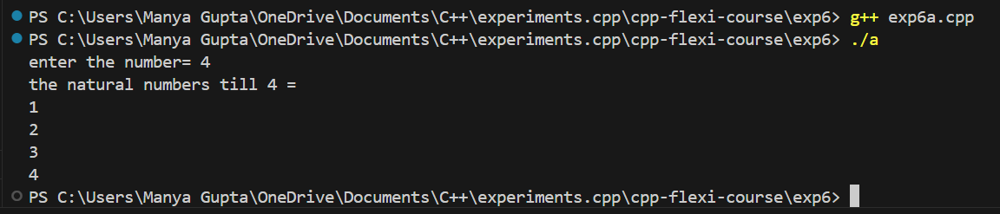
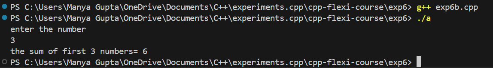
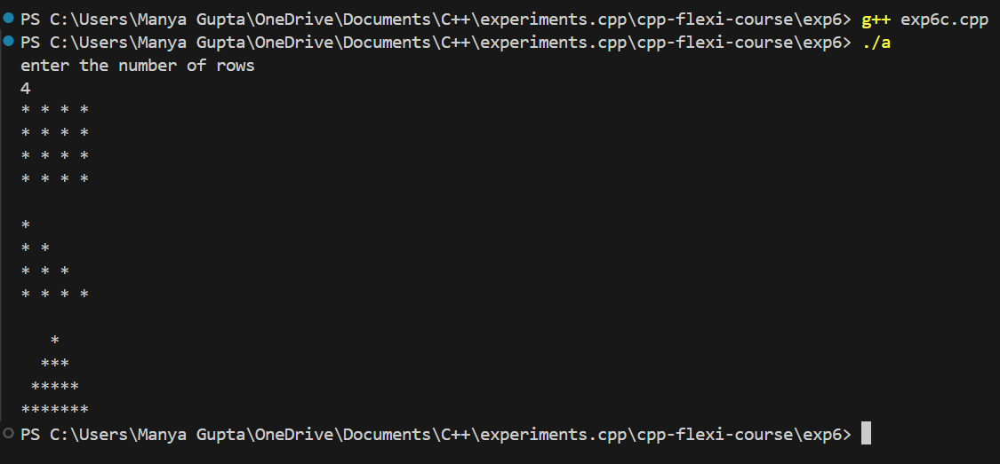
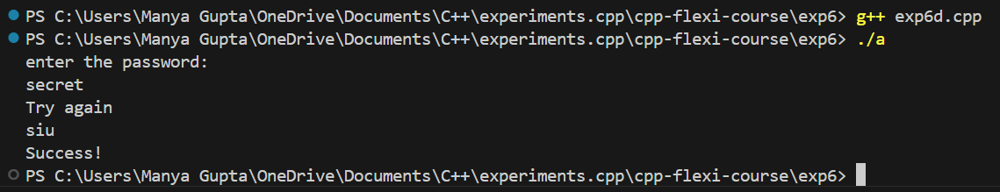
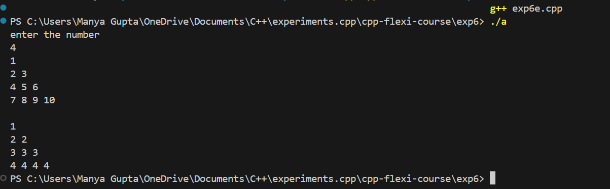
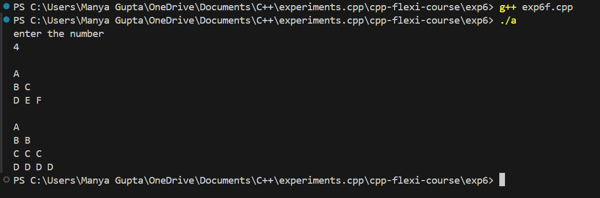

# C++ Flexi Course - Exercise 6

This directory contains the materials and code for **Exercise 6** of the C++ Flexi Course. This exercise demonstrates basic C++ programming concepts including user input, loops, and character manipulation.

## Overview

In this exercise, you will:
- Learn to use basic input and output functions in C++.
- Implement loops to produce patterns based on user input.
- Understand the use of `cin` for input and `cout` for output in C++.

## Features

- **Number Printing Loop:** Prints integers from 1 up to a user-provided number.
- **Alphabet Patterns:** Generates two different patterns based on user input:
    - A sequence of increasing alphabetic characters.
    - A sequence of repeating alphabetic characters.

## Prerequisites

Before running the code, ensure you have the following:
- **C++ Compiler:** A C++ compiler such as `g++` or `clang++`.
- **Basic Knowledge of C++:** Familiarity with C++ syntax, loops, and input/output operations.

## Setup

To set up the project locally, follow these steps:

## Getting Started

Follow these steps to set up and run the exercise:

### 1. Clone the Repository

```bash
git clone https://github.com/manyagupta0209/cpp-flexi-course.git
cd cpp-flexi-course/exp6

g++ -o output src/main.cpp [additional source files] -Iinclude
./output

exp6/
├── src/
│   ├── main.cpp          # Main source code file
│   ├── [additional .cpp files]
├── include/
│   ├── [header files]
├── README.md             # This file
└── [any other relevant files]
```

### 2. Compilation and Execution
To run the experiments:

### Using Command Line

-Run the compiled program:
```bash
g++ exp6(name_of_exp).cpp
./a
```

## Output 
- Exp6a:

 

- Exp6b:



- Exp6c:



- Exp6d:



- Exp6e:



- Exp6f:

