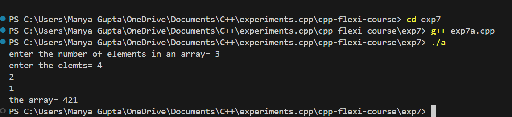
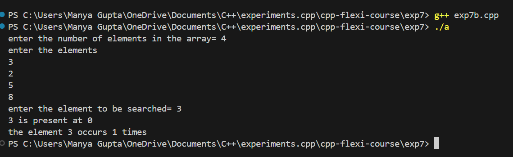
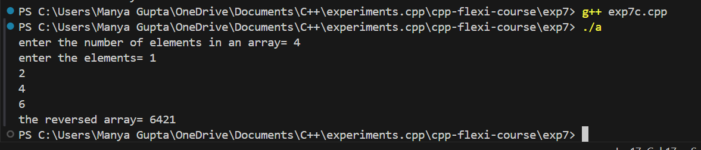
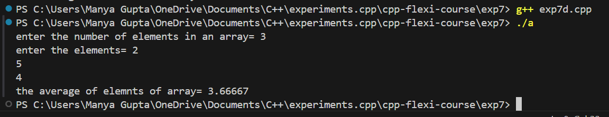
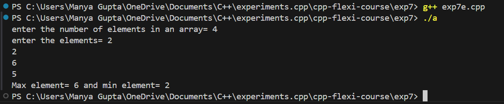

# C++ Flexi Course - Array Experiments

This directory contains the materials and code for various array experiments in C++ as part of the C++ Flexi Course. These experiments cover basic array operations including input, searching, reversing, averaging, and finding maximum and minimum values.

## Overview

In these experiments, you will:
- Learn to work with arrays in C++.
- Implement various operations such as input, search, reverse, average, and find maximum/minimum values.

## Features

- *Array Input:* Read and store elements in an array.
- *Element Search:* Search for an element in the array and count its occurrences.
- *Array Reversal:* Print array elements in reverse order.
- *Average Calculation:* Calculate and display the average of array elements.
- *Max/Min Finder:* Determine and display the maximum and minimum values in the array.

## Prerequisites

Before running the code, ensure you have the following:
- *C++ Compiler:* A C++ compiler such as g++ or clang++.
- *Basic Knowledge of C++:* Familiarity with C++ syntax, arrays, loops, and input/output operations.

## Setup

To set up the project locally, follow these steps:

### 1. Clone the Repository

Clone the repository to your local machine:

bash
git clone https://github.com/manyagupta0209/cpp-flexi-course.git
cd cpp-flexi-course/exp7

exp6/
├── src/
│   ├── array_input.cpp         # Source code for array input
│   ├── element_search.cpp       # Source code for element search
│   ├── array_reversal.cpp       # Source code for array reversal
│   ├── average_calculation.cpp  # Source code for average calculation
│   ├── max_min_finder.cpp       # Source code for max/min finder
├── include/
│   ├── [header files]
├── README.md  

### 2. Compilation and Execution
 To run the experiments:

### Using Command Line

-Run the compiled program:
    bash
    g++ exp7(name_of_exp).cpp
    ./a
    

## Output
- Exp7a:

- Exp7b:

- Exp7c:

- Exp7d:

- Exp7e:

