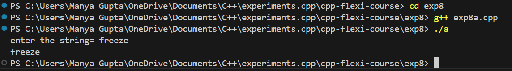
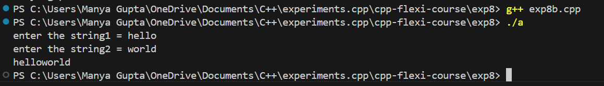
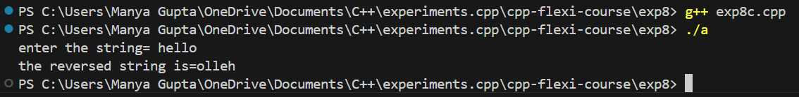
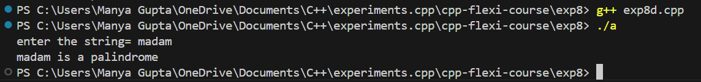
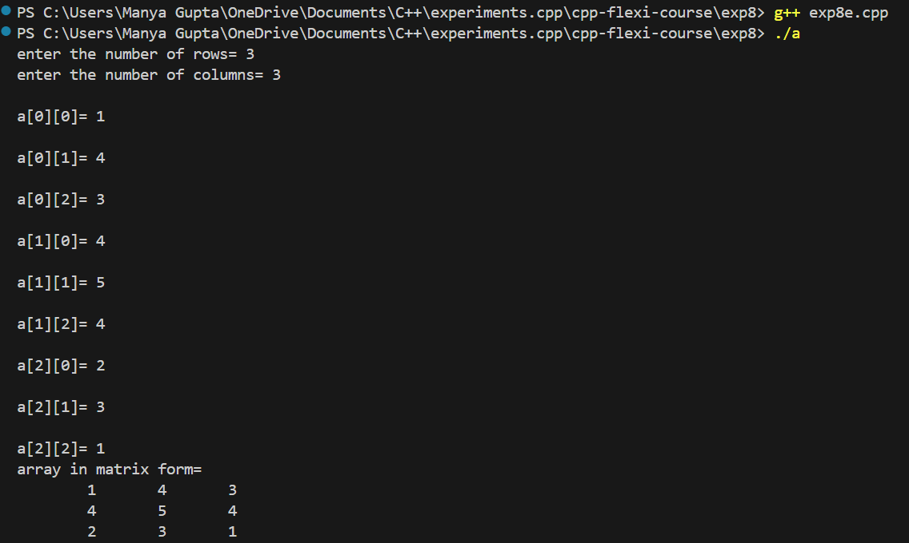

# C++ Flexi Course - Array Experiments

This directory contains the materials and code for various array experiments in C++ as part of the C++ Flexi Course. These experiments cover basic array operations including input, searching, reversing, averaging, and finding maximum and minimum values.

## Overview

In these experiments, you will:
- Learn to perform basic string operations in C++.
- Implement various operations such as string concatenation, reversal, and palindrome checking.

## Features
- **Input String:** Input a string with whitespaces.
- **String Concatenation:** Combine two strings into one.
- **String Reversal:** Reverse the characters of a string.
- **Palindrome Checking:** Check if a string reads the same backward as forward.
- **2D Array Input and Matrix Display**: This program allows users to input the number of rows and columns for a 2D array, followed by the elements of the array.
- **Matrix Operations:** This program performs basic matrix operations, including addition and multiplication:
## Prerequisites

Before running the code, ensure you have the following:
- **C++ Compiler:** A C++ compiler such as `g++` or `clang++`.
- **Basic Knowledge of C++:** Familiarity with C++ syntax, strings, and basic input/output operations.

## Setup

To set up the project locally, follow these steps:

### 1. Clone the Repository

Clone the repository to your local machine:

```bash
exp8/
├── src/
│   ├── input_spacedstring.cpp  # Source code for string concatenation
│   ├── string_concatenation.cpp  # Source code for string concatenation
│   ├── string_reversal.cpp        # Source code for string reversal
│   ├── palindrome_check.cpp       # Source code for palindrome checking
├── include/
│   ├── [header files]
├── README.md                      # This file
└── [any other relevant files]
```

### 2. Compilation and Execution
To run the experiments:

### Using Command Line

-Run the compiled program:
```bash
g++ exp8(name_of_exp).cpp
./a
```

## Output
- Exp8a:



- Exp8b:



- Exp8c:



- Exp8d:



- Exp8e:

