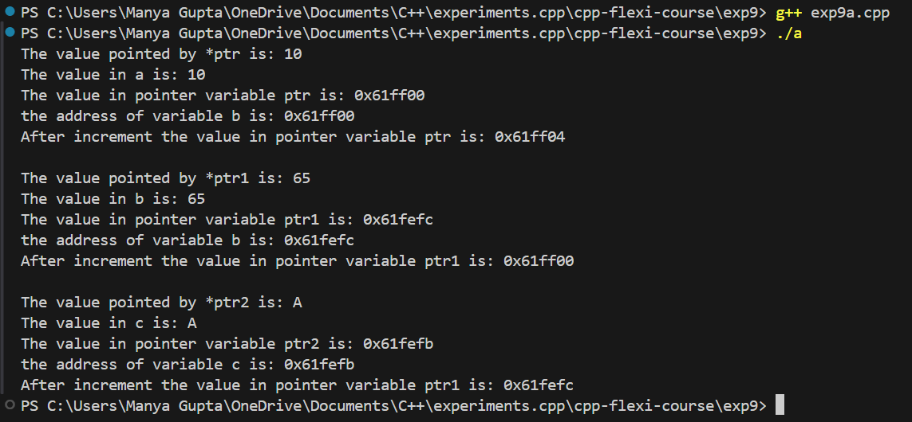
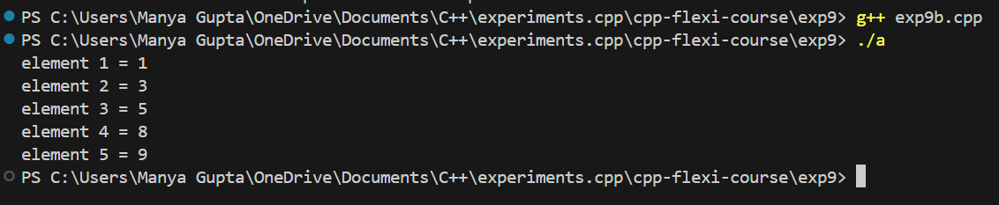
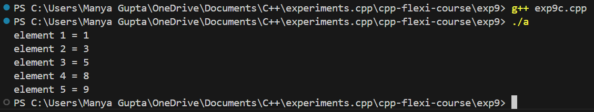

# Experiment on Pointers and Array Access in C++

## AIM
The goal of this experiment is to:
- Understand and utilize pointers for different data types.
- Access and manipulate array elements using pointers.
- Differentiate between accessing array elements using pointer variables and without them.

## Software Used
- **VS Code** (or any C++ compatible IDE)

## Problem Statement
This project consists of three separate C++ programs:

1. **Initialize and manipulate pointers for different data types (int, float, and char).**
2. **Access elements of an array using a pointer.**
3. **Access elements of an array without using a pointer variable.**

## Files and Description

### 1. **exp9a.cpp: Initialize and Manipulate Pointers of Different Data Types**

This program demonstrates:
- Initializing and manipulating pointers of different data types (`int`, `float`, and `char`).
- Printing the values and addresses of variables using pointers.
- Incrementing pointer values to show how pointer arithmetic works.

### 2. **exp9b.cpp: Access Array Elements Using Pointer**

This program demonstrates how to:

- Access elements of an array using a pointer.
- Iterate through the array elements by incrementing the pointer.

### 3. **exp9c.cpp: Access Array Elements Without Using Pointer Variable**

- This program accesses elements of an array without using a pointer variable. Instead, it utilizes pointer arithmetic directly on the array name.

Before running the code, ensure you have the following:
- **C++ Compiler:** A C++ compiler such as `g++` or `clang++`.
- **Basic Knowledge of C++:** Familiarity with C++ syntax, strings, and basic input/output operations.

## Setup

To set up the project locally, follow these steps:

### 1. Clone the Repository

Clone the repository to your local machine:

```bash
exp9/
├── src/
│   ├── input_spacedstring.cpp  # Source code for string concatenation
│   ├── string_concatenation.cpp  # Source code for string concatenation
│   ├── string_reversal.cpp        # Source code for string reversal
│   ├── palindrome_check.cpp       # Source code for palindrome checking
├── include/
│   ├── [header files]
├── README.md                      # This file
└── [any other relevant files]
```

### 2. Compilation and Execution
To run the experiments:

### Using Command Line

-Run the compiled program:
```bash
g++ exp9(name_of_exp).cpp
./a
```
## Output
- Exp9a:



- Exp9b:



- Exp9c:

